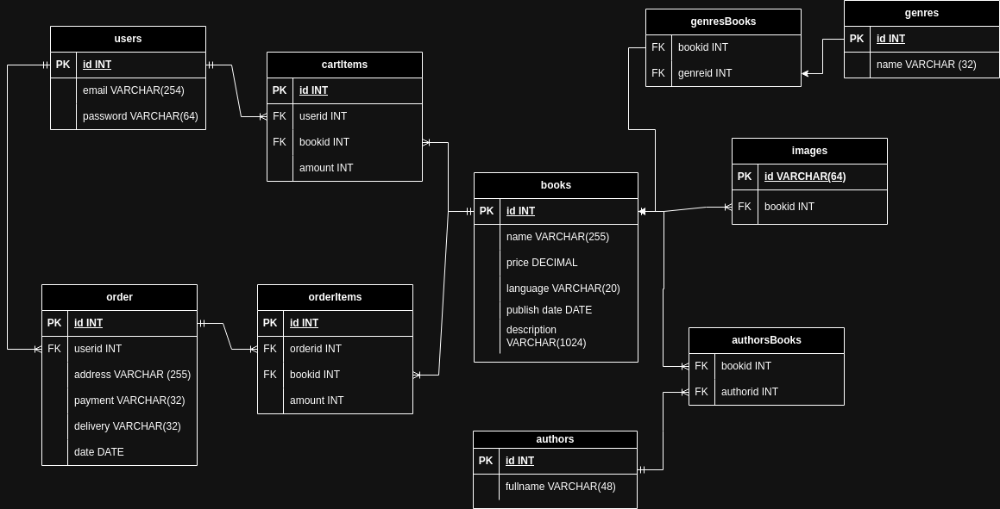

# Figma Link 
https://www.figma.com/file/z4aLKnfBvctzZRocRW4WUE/WTECH?type=design&node-id=0%3A1&mode=design&t=gSTnflJ8kRcQCx8A-1

# Fyzický dátový model
 

# Needed stuff
PHP 8.3, php packages from packages.txt, composer, nodejs, npm

# Run app:

cd eshop
npm install && npm run dev

in another terminal:
php artisan serve  

# TODO?

* zobrazenie prehľadu všetkých produktov z vybratej kategórie používateľom - 
    * !!!IMAGES TODO!!!
    * základné filtrovanie (aspoň podľa 3 atribútov, napr. rozsah cena od-do, značka, farba) - Done
    * stránkovanie - Done
    * preusporiadanie produktov (napr. podľa ceny vzostupne/zostupne) - Done
* zobrazenie konkrétneho produktu - detail produktu
    * pridanie produktu do košíka (ľubovolné množstvo)
* plnotextové vyhľadávanie nad katalógom produktov
* zobrazenie nákupného košíka
    * zmena množstva pre daný produkt
    * odobratie produktu
    * výber dopravy
    * výber platby
    * zadanie dodacích údajov
    * dokončenie objednávky
	* umožnenie nákupu bez prihlásenia
	* prenositeľnosť nákupného košíka v prípade prihláseného používateľa 
* registrácia používateľa/zákazníka - Done
* prihlásenie používateľa/zákazníka - Done
* odhlásenie zákazníka - Done

